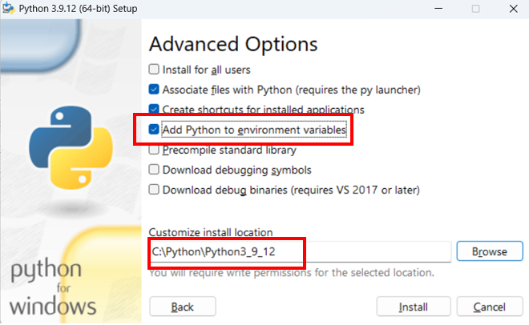

# DonkeyBro(edited by jacksmith)

<p align="center">
  <br>
  
  <br>
</p>

# Contributors
|     PI     |     EL     |   EM   |    EM    |    EM    |    EM    |
|   :-----:   |   :-----:   | :------: |   :-----:   |   :-----:   |   :-----:   |
|   Sunho Park(Prof)    |   Sungwoong Yun    |   Sungjoon Yang    |   Hoil Lee    |   Jeseok Oh    |   Kibum Yun    |

<!--
PI: Sunho Park
EL: Sungwoong Yun
EM: Sungjoon Yang
EM: Hoil Lee
EM: Jeseok Oh
EM: Kibum Yun
-->

# ※프로젝트 구축방법(윈도우 버전)

## 기본적으로 설치되어 있어야 할 프로그램

1. vscode([링크](https://code.visualstudio.com/download))
2. git([링크](https://git-scm.com/))
3. msys([링크](https://www.msys2.org/))
4. 파이썬(3.9.12)([링크](https://www.python.org/downloads/))

<br>

|     vscode     |     git     |   msys   |    python   |
|   :--------:   |  :--------: | :------: |   :-----:   |
|   ![vscode]    |   ![git]    | ![msys]  |  ![python]  |

<br>

## 0. msys 설치후,  환경설정 해주기

셋업파일을 다운로드 받고 설치해준다.

이후 아래 명령어를 작성해준다.

```shell
pacman -Suy
pacman -S wget unzip mingw-w64-ucrt-x86_64-hdf5 mingw-w64-ucrt-x86_64-ffmpeg
```


## 1. 파이썬 설치후, 가상환경 구축하기

파이썬은 무조건 3.9.12버전을 설치해주어야 한다. 만약 다른 버전이 설치되어 있더라도 해당 버전으로 바꾸어주어야 하니 설치해주자.

(물론 3.7, 3.8에서도 동작하지만 저작자와 맞추기 위함이다. 그리고 3.10이상에서는 잔오류가 많이 발생하게 된다.)

<div>
	
</div>

이후 아래와 같이 설치한다.


Next!


아래와 같이 세가지를 체크해주고, 설치경로를 다음과 같이 `C:\Python\Python3_9_12` 맞춰준다.



이렇게 깔리면 아래와 같이 구조가 잡히게 된것이다.


이후 수동으로 환경변수(사용자변수)를 잡아주자.


## 2. DonkeyBro 프로젝트 설치하기
<!-- ## 2. donkeycar_projects 설치하기 -->
다음과 같이 C드라이브 바로 아래에 DonkeyBro프로젝트를 생성한다.

```
cd C:\
```


해당([링크](https://github.com/YUNSUNGWOONG/donkeycar_projects))로 git clone을 해준다.

```shell
git clone https://github.com/YUNSUNGWOONG/DonkeyBro.git
cd DonkeyBro
```

기존 서브모듈들을 최신버전으로 업데이트 해준다.

```shell
git submodule init
```


## 3. 가상환경 구축하기

cmd창에서 DonkeyBro로 와주고, 가상환경 패키지 및 가상환경 구축을 해준다.

```shell
pip install virtualenv
virtualenv env
```


이후 가상환경에 접속해준다.
```shell
cd env/Scripts
activate
cd ..
cd ..
```


아래 것들을 설치해준다.

```shell
python.exe -m pip install --upgrade pip
pip install --upgrade wheel setuptools
```


## 4. donkeycar/gym-donkeycar 의존성 패키지 설치하기

DonkeyBro에 들어가면 donkeycar가 있을것이다. cmd창으로 여기를 들어가준다. 그리고 서브패키지를 설치해준다.

```shell
cd donkeycar
pip install -e .
cd ..
```

DonkeyBro에에 들어가면 gym-donkeycar가 있을것이다. cmd창으로 여기를 들어가준다. 그리고 서브패키지를 설치해준다.

```shell
cd gym-donkeycar
pip install -e .
cd ..
```


## 5. library_sheet에서 의존성 패키지 설치하기

DonkeyBro에에 들어가면 library_sheet가 있을것이다. cmd창으로 여기를 들어가준다. 그리고 서브패키지를 설치해준다.

```shell
cd library_sheet
pip install -r requirements_dynamic.txt
pip install -r requirements_for_windows.txt
cd ..
```


## 6. donkeysim(시뮬레이터) 설치하기(가상환경에서 돌릴경우에만)

파워셀을 키고 아래와 같이 zip파일을 다운받고 압축을 풀어주자.

```shell
curl -O -L https://github.com/tawnkramer/gym-donkeycar/releases/download/v22.11.06/DonkeySimWin.zip
tar -zxvf DonkeySimWin.zip
```


## 7. cars안에 mycar 생성하고 실행해보기

1)`DonkeyBro` 아래에 `cars`라는 폴더를 만들어줍니다.

(차량들을 모아둘, 비유하자면 일종의 주차장 같은 겁니다.)

```shell
mkdir cars
cd cars
```

2)이제 기본 차량을 만들어줍니다.

```shell
donkey createcar --path mycar
cd mycar
```

3)이제 mycofnig.py파일에 들어가 다음과 같이 수정해줍니다.

수정전>


수정후>


4)현재 mycar디렉토리에서 다음 명령어를 적어줍니다.

```shell
python manage.py drive
```

<웹브라우저에 localhost:8887이라고 적어주세요.>(아래그림: 웹브라우저와 콘솔창)


(아래그림: 시뮬레이션 화면)


## 8. cars안에 car_dl, car_cv 생성하기

이번에는 두가지 각각 다른 템플릿이 탑재된 차량템플릿을 적용해서, 차량을 생성해보겠습니다.

### Template(1): Computer-Vision

```shell
donkey createcar --template=cv_control --path car_cv
```

### Template(2): Path-Follow(DeepLearning)

```shell
donkey createcar –template=path_follow --path car_dl
```

최종적으로 아래와 같이 아키텍처를 구축하게 됩니다.


## 9. 카메라로 데이터 수집하기(Data collection)

python manage.py drive로 주행을 하게 되면 동작에 따라 실시간으로 데이터를 수집하게 됩니다.

최소 10바퀴정도를 돌려서 학습데이터셋을 수집합니다.


## 10. driving model 훈련시키기(Train Data)

tensorflow를 통해 훈련을 시키기 위해서는 msvcp140.dl파일이 필요하며, 이는 Microsoft Visual C++ Redistributable 패키지에 포함되어 있다.([관련사이트](https://learn.microsoft.com/ko-kr/cpp/windows/latest-supported-vc-redist?view=msvc-170))<br>
컴퓨터 설정에 맞춰 둘중 하나를 설치해서 실행해준다.<br>
64비트일 경우: [`vc_redist.x64.exe`](https://aka.ms/vs/17/release/vc_redist.x64.exe)<br>
32비트일 경우: [`vc_redist.x86.exe`](https://aka.ms/vs/17/release/vc_redist.x86.exe)<br>

설치가 다 완료되면 아래 순서를 진행해준다.<br>
mycar디렉토리를 보면 train.py가 있습니다. 이를 활용하여 두가지 방식중 하나를 복붙해서 훈련을 시켜준다.<br>

```shell
# python 명령어를 사용하는 경우
python train.py --tubs=./data --model=./models/mypilot.h5
# donkey 명령어를 사용하는 경우
donkey train -tub ./data -model ./models/mypilot.h5
```


## 11. 훈련모델을 사용해서 자율주행하기(Auto-Driving)

위 명령어를 통해 학습을 시키면 mypilot.h5라는 h5포맷의 AI파일 생성될 뿐만 아니라 .tflite 포맷의 AI파일도 생성된다.이후에 해당 학습된 모델을 사용하기 위해서는 다음과 같다.

- h5파일을 사용할 경우

```shell
# python 명령어를 사용하는 경우
python manage.py drive --model ./models/mypilot.h5
# donkey 명령어를 사용하는 경우(이거는 시도해보지 않았다)
donkey manage -model ./models/mypilot.h5
```

- tflite파일을 사용할 경우

```shell
# python 명령어를 사용하는 경우
python manage.py drive --model ./models/mypilot.tflite --type tflite_linear
# donkey 명령어를 사용하는 경우(이거는 시도해보지 않았다)
donkey manage -model ./models/mypilot.tflite -type tflite_linear
```


<br>

## 개선점

<p align="justify">
  아직 강화학습(ddqn)에 대한 부분과, docker를 통해 VirtualLeague를 구축하는 부분에 대해서는
  좀 더 공부해야 할 부분이다.
</p>
<br>

## 라이센스

MIT &copy; [YUNSUNGWOONG](mailto:2170004487z@gmail.com)

<!-- Stack Icon Refernces -->

[vscode]: ./images/stack/vscode.svg
[git]: ./images/stack/git.svg
[msys]:  ./images/stack/msys2.svg
[python]:  ./images/stack/python.svg
